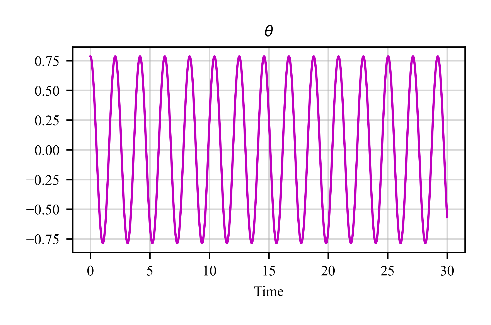

# Summary
Dynamic systems play a critical role across various fields such as robotics, aerospace, and control theory. While Python offers robust mathematical tools, it lacks a dedicated framework tailored for dynamic systems. **C4DYNAMICS** bridges this gap by introducing a Python-based platform designed for state-space modeling and analysis. The framework's modular architecture, with "state objects" at its core, simplifies the development of algorithms for sensors, filters, and detectors. This allows researchers, engineers, and students to effectively design, simulate, and analyze dynamic systems. By integrating state objects with a scientific library, **C4DYNAMICS** offers a scalable and efficient solution for dynamic systems modeling.

# Statement of Need
Modeling and simulation of dynamical systems are essential across robotics, aerospace, and control engineering. While Python provides powerful numerical libraries (e.g., NumPy, SciPy) and several domain-specific frameworks, none directly support low-level, state-space–based algorithm development.

**C4DYNAMICS** is designed for engineers who prefer code-based modeling and want a framework to explicitly define the variables encapsulated in the system’s state vector, and perform streamlined mathematical operations such as scalar multiplication, dot products, and vector addition/subtraction, and data operations such as storing states, retrieving histories, and plotting variables.


# Comparison with Existing Software
Existing tools generally fall into two categories: 
  1) Block-diagram frameworks (e.g., SimuPy [@Margolis2017simupy], BdSim [@NEVAY2020107200]) mimic Simulink and simplify model building through graphical interfaces, but they abstract away the state vector and limit direct mathematical manipulation. 
  2) High-level simulators (e.g., [IR-Sim](https://ir-sim.readthedocs.io/en/stable/), RobotDART [@Chatzilygeroudis2024]) allow algorithm testing in predefined environments, but lack flexibility for core system modeling and algorithm design.

This leaves a gap for engineers and researchers who wish to work explicitly at the state-space level—defining variables, performing mathematical operations on them, and integrating with modern data-driven pipelines.

**C4DYNAMICS** fills this gap with a modular, Python-native framework for state-space modeling of dynamical systems. Built around explicit state representations and complemented by a scientific library of filters and sensor models, it enables reproducible modeling, testing, and optimization of dynamic systems within the scientific Python ecosystem.


# Example 
A simple pendulum with a point mass on a rigid massless rod of length = `1[m]`, swiniging under gravity of `9.8[m/s²].` with initial angle `θ = 50[°]` and angle rate `q = 0[°/s]`, integrated with `solve_ivp` 
with a time step of `0.01[s]` for `5[s]`.

Import required packages:
```
from scipy.integrate import solve_ivp
from matplotlib import pyplot as plt 
import c4dynamics as c4d
import numpy as np 
```

Define a state object (`pend`) and run the main-loop:
```
dt = 0.01 
pend  = c4d.state(theta = 50 * c4d.d2r, q = 0)

for ti in np.arange(0, 5, dt): 
  pend.store(ti)
  pend.X = solve_ivp(lambda t, y: [y[1], -9.8 * c4d.sin(y[0])], [ti, ti + dt], pend.X).y[:, -1]

pend.plot('theta', scale = c4d.r2d, darkmode = False)
plt.show()

```



# References
\nocite{1104873}
\nocite{[@Margolis2017simupy]}

---
bibliography: paper.bib
