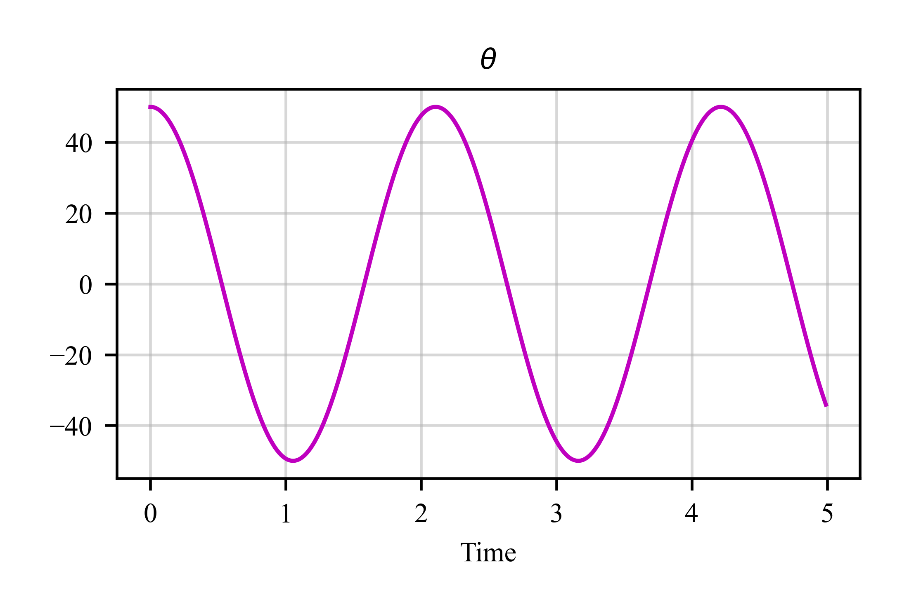

# Abstract

<div style="text-align: justify">  

Dynamic systems play a critical role across various fields such as robotics, aerospace, and control theory. While Python offers robust mathematical tools, it lacks a dedicated framework tailored for dynamic systems. C4dynamics addresses this gap by introducing a Python-based platform designed for state-space modeling and analysis. With the `state object` at its core, c4dynamics simplifies the development of algorithms for sensors, filters, and detectors through its modular structure. The framework's state objects, along with an integrated scientific library, empower researchers, engineers, and students to effectively develop algorithms for dynamic systems.


# Introduction
Dynamic systems are central to a wide range of scientific and engineering disciplines, from `control theory` to `robotics` and `aerospace`. These systems involve changing states over time, typically described by differential or difference equations. 
Unlike static systems, dynamic systems evolve with time, making them more complex to model and analyze. The `state-space model` formalizes this behavior by representing the system's state as a vector of variables. This vector evolves according to predefined rules and provides a structured approach to modeling, making it a natural fit for the analysis of dynamic systems.
The general form of the state-space model is:

$$
x[k+1]=A⋅x[k]+B⋅u[k]  
$$
$$
y[k]=C⋅x[k]  
$$
Where:  
$x[k]$ is the state vector  
$u[k]$ is the input  
$y[k]$ is the output  
$A,B,C$ are matrices defining the system dynamics  
$k$ is the discrete-time parameter  
 
State-space models are widely used to represent both linear and nonlinear systems. 

`MATLAB` has long been a popular choice for dynamic systems modeling due to its strong support for matrix operations and built-in toolboxes. However, `Python` offers distinct advantages, such as open-source accessibility, a large community, and integration with modern software engineering practices. 
Python’s ecosystem, with libraries like NumPy and SciPy, provides robust mathematical tools, but it lacks a dedicated framework specifically for dynamic systems. 

`C4DYNAMICS` bridges this gap, offering a flexible environment for developing and implementing algorithms that handle dynamic systems using the state-space representation in Python. 
Designed to simplify the development of algorithms, c4dynamics offers engineers and researchers a systematic approach to model, simulate, and control systems in fields like robotics, aerospace, and navigation.
With integrated modules for sensors, detectors, and filters, c4dynamics accelerates algorithm development while maintaining flexibility and scalability.


# C4dynamics Architecture
C4dynamics is structured around two primary building blocks:

## State Data Structures
These classes encapsulate a state vector, allowing data management and mathematical operations on the system state. 

## Scientific Library
Modules in this library operate on state objects, enabling the development of algorithms for sensors, filters, and detectors.


figure 1: C4dynamics dependency diagram 

This modular architecture allows for the easy extension of both state classes and functional capabilities, making it flexible for different dynamic system applications.


# State Objects
## The State Class
The 'State' class is the core data structure in c4dynamics, representing the system's state vector. This class provides utilities for manipulating the state vector, including mathematical operations and data management tasks. Developers can subclass the 'State' class to create custom representations for their specific dynamic systems.
Given a state object s with arbitrary variables x, y, z, the following tables summarize the mathematical and data operations on the state vector s.X:
  
``` python   
>>> from c4dynamics import state  
>>> from c4dynamics.rotmat import dcm321  
>>> s = state(x = 1, y = 0, z = 0)  
>>> print(s)  
[ x  y  z ]  
>>> s.X   
[1  0  0]  
```


### Mathematical Operations

| Operation	| Example | 
|-----------|---------|  
| Scalar Multiplication |	`>>> python s.X * 2` <br> `[2  0  0]` |  
| Matrix Multiplication	| `>>> R =  dcm321(psi = c4d.pi / 2)` <br> `>>> s.X @ R` <br> `[0  1  0]` | 
| Norm Calculation | `>>> np.linalg.norm(s.X)` <br> `1` |  
| Addition/Subtraction | `>>> s.X + [-1, 0, 0]` <br> `[0  0  0]` |   
| Dot Product	| `>>> s.X @ s.X` <br> `1` |  
| Normalization	| `>>> s.X / np.linalg.norm(s.X)` <br> `[1  0  0]` |  


### Data Operations  
| Operation |	Example |  
|-----------|---------| 
| Store the current state	| `>>> s.store()` |  
| Store with time-stamp	| `>>> s.store(t = 0)` |  
| Store the state in a for-loop	| `>>> for t in np.linspace(0, 1, 3):` <br> `...   s.X = np.random.rand(3)`  <br> `...   s.store(t)` | 
| Get the stored data	| `>>> s.data()`  <br> `[[0     0.37  0.76  0.20]`  <br> `[0.5    0.93  0.28  0.59]`  <br> `[1      0.79  0.39  0.33]]` |  
| Get the time-series of the data	| `>>> s.data('t')` <br> `[0  0.5  1]` |  
| Get data of a variable | `>>> s.data('x')[1]` <br> `[0.37  0.93  0.79]` |   
| Get time-series and data of a variable | `>>> time, y_data = s.data('y')`  <br> `>>> time` <br> `[0  0.5  1]` <br> `>>> y_data` <br> `[0.76  0.28  0.39]` |  
| Get the state at a given time	| `>>> s.timestate(t = 0.5)` <br> `[0.93  0.28  0.59]` |   
| Plot the histories of a variable | `>>> s.plot('z')` <br> `…` |  

## Predefined State Classes
C4dynamics provides several predefined state classes that encapsulate common types of states in dynamic systems:
- ``datapoint``: A point in space, representing the simplest form of a state vector.
- ``rigidbody``: An extension of `datapoint` that adds rigid body properties, including orientation and angular velocity.
- ``pixelpoint``: A point in an image, used in vision-based navigation and detection algorithms.


# Scientific Library
The second building block of c4dynamics is a library of sensors, filters, and detectors, and other utilities to support efficient and convenient development of algorithms for dynamic systems.  
## Sensors
The sensor library in c4dynamics provides classes to simulate real-world sensor behavior:
- ``Seeker``: Models a seeker sensor for target tracking, commonly used in missile guidance systems.
- ``Radar``: Simulates radar systems for object detection and ranging.
## Detectors
The detector library offers machine learning-based object detection capabilities:
- ``Yolov3``: A class for applying the YOLOv3 algorithm for real-time object detection in images, useful in vision-based systems.
## Filters
The filtering library includes essential algorithms for state estimation:
- ``Kalman Filter``: A standard Kalman filter for linear systems.
- ``Extended Kalman Filter (EKF)``: A variant for handling nonlinear systems by linearizing around the current estimate.
## Utils
The utils library provides auxiliary tools for debugging, performance measurement, and visualization:
- `Print with Color`: Enhanced console logging with color for better readability during debugging.
- `GIF Generator`: A tool for creating animations from data.
- `Numpy Aliases`: Simplified functions for common mathematical operations.
- `Plotting Configurations`: Predefined configurations for visualizing system states.
- `Tic-Toc Measures`: Tools for measuring execution time, useful for performance optimization.


# Program Workflow 
C4dynamics demonstrates its full potential through an end-to-end program, starting with state objects, progressing through developing and testing algorithms with one or more modules from the package scientific library, and concluding with built-in tools for result analysis. This entire procedure can be summarized by the diagram in figure 2.


figure 2: workflow to program an end-to-end scene with c4dynamics modules.  
## Pendulum example 
The following is a simulation of a simple pendulum using C4dynamics.
import c4dynamics as c4d
from scipy.integrate import solve_ivp 
from matplotlib import pyplot as plt 
import numpy as np 
```python 
L = 1 								# rod length (m)  
tmax, dt = 30, 0.01  
t = np.arange(0, tmax + dt, dt)  
  
''' STATE OBJECTS SETUP '''  
pend  = c4d.state(theta = np.pi / 4, omega = 0)   # pendulum definition  
  
def pendulum(t, y):   
  return y[1], -(c4d.g_ms2 / L) * np.sin(y[0])    # equations of motion   

''' MAIN LOOP '''  
for i, ti in enumerate(t):  
  pend.store(ti)                                  # store current state   
  pend.X = solve_ivp(pendulum, [0, dt], pend.X).y[:, -1]  
  
  
''' PLOT RESULTS '''  
pend.plot('theta', filename = 'pendulum.png')  
plt.show()  
```

 
 
# Summary
C4dynamics is a powerful and flexible Python framework designed to address the gap in dynamic systems modeling. By providing modular state objects and scientific library for sensors, detectors, and filters, it enables users to build and simulate complex dynamic systems with ease. Whether in control theory, robotics, or signal processing, c4dynamics offers a robust platform for dynamic systems development. C4dynamics not only fills a critical gap in dynamic systems modeling but also provides a scalable, open-source solution for researchers and practitioners alike.


</div>


# Acknowledgements

We acknowledge contributions from Brigitta Sipocz, Syrtis Major, and Semyeong
Oh, and support from Kathryn Johnston during the genesis of this project.

# References
